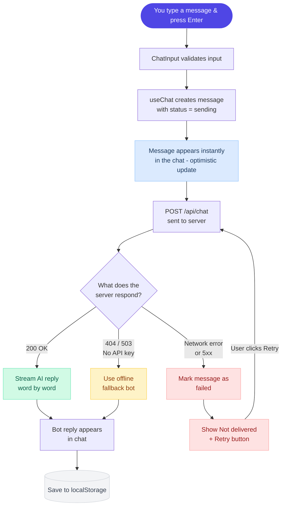
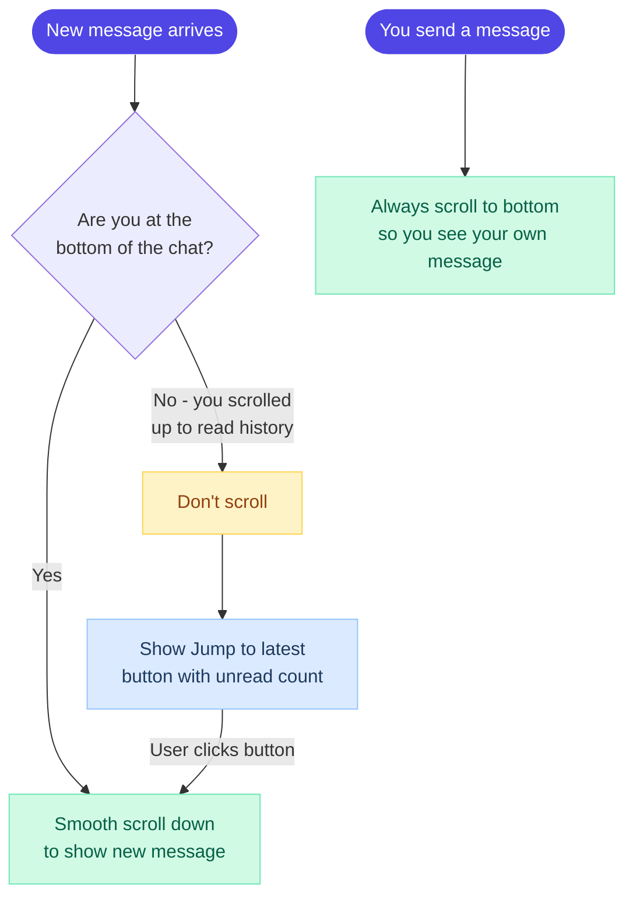
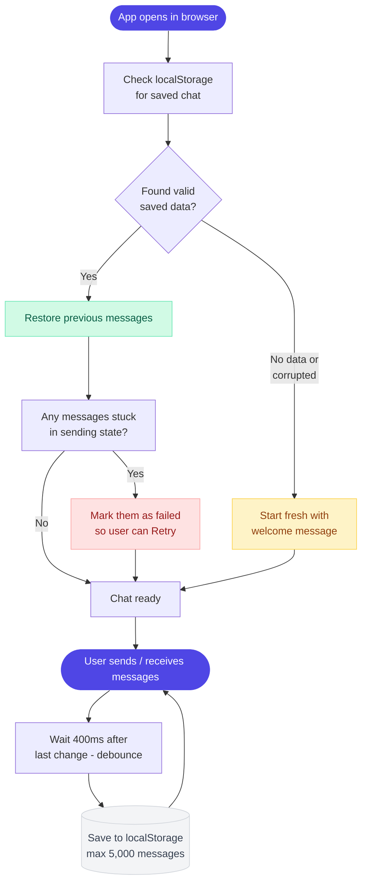
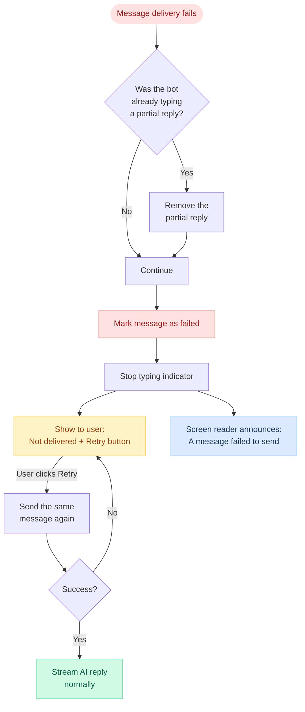
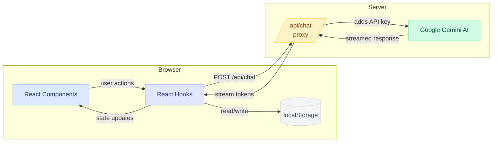
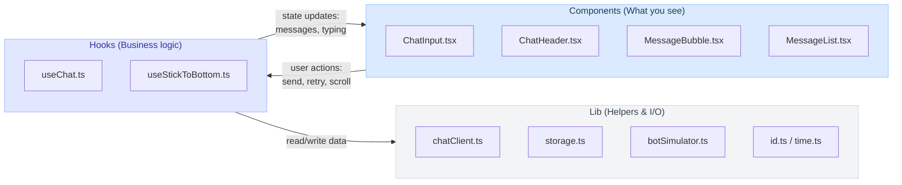

# Darwix AI — Chat Interface

**Live Demo:** [https://darwix-chat-ebon.vercel.app](https://darwix-chat-ebon.vercel.app)

A clean, fast, and fully accessible chat app built as a take-home assignment for
the **Darwix AI Frontend Developer Intern** role.

**What it does:** You type a message, it gets sent to Google Gemini AI, and the
reply streams back word by word — just like ChatGPT. If Gemini isn't set up, a
built-in offline bot takes over so the app still works without any setup.

**What makes it special:**
- Messages stream in live (not all at once)
- Works on phone and desktop
- Handles 1,000+ messages without slowing down (virtualised list)
- Your chat is saved in the browser — refresh and it's still there
- Fully keyboard and screen-reader accessible
- The API key stays on the server (never sent to the browser)

> **Built with:** React 19, TypeScript, Vite 6, Tailwind CSS v4, TanStack Virtual, Google Gemini

---

## Table of Contents

- [Quick Start](#quick-start)
  - [Enable Real AI Replies](#enable-real-ai-replies-optional-free)
  - [Available Scripts](#available-scripts)
  - [Things to Try](#things-to-try)
- [All Features](#all-features)
  - [Layout](#1-layout)
  - [Messages](#2-messages)
  - [Core Functionality](#3-core-functionality)
  - [Accessibility](#4-accessibility)
  - [Advanced Features](#5-advanced-features)
  - [Performance](#6-performance)
- [How It Works (Flow Diagrams)](#how-it-works-flow-diagrams)
  - [What happens when you send a message?](#what-happens-when-you-send-a-message)
  - [How does auto-scroll work?](#how-does-auto-scroll-work)
  - [How is chat history saved?](#how-is-chat-history-saved)
  - [What happens when something goes wrong?](#what-happens-when-something-goes-wrong)
  - [Complete data flow](#complete-data-flow-browser--server--ai--back)
- [Project Structure](#project-structure)
- [How the pieces connect](#how-the-pieces-connect)
- [Security](#security)
- [Deployment](#deployment)
- [Browser Support](#browser-support)

---

## Quick Start

```bash
npm install
npm run dev        # opens at http://localhost:5173
```

That's it. The app runs right away with an offline bot — no API key needed.

### Enable Real AI Replies (optional, free)

Want real AI answers? Get a free Google Gemini key (no credit card needed):

1. Go to **https://aistudio.google.com/apikey** and create a key
2. Set it up:

```bash
cp .env.example .env
# open .env and paste your key: GEMINI_API_KEY=your-key-here
npm run dev
```

The key is only used on the server — it never gets sent to the browser.

### Available Scripts

| Command | What it does |
|---|---|
| `npm run dev` | Start dev server with hot reload |
| `npm run build` | Check types + build for production |
| `npm run preview` | Preview the production build locally |
| `npm run lint` | Run ESLint |
| `npm run typecheck` | Check TypeScript types only |

### Things to Try

1. **Send a message** — press Enter to send, Shift+Enter for a new line
2. **Watch it stream** — the AI reply appears word by word
3. **Break the network** — disconnect Wi-Fi and send a message; you'll see "Not delivered" with a Retry button
4. **Load 1,000 messages** — click the menu (three dots) → "Load demo conversation" and scroll around — it stays fast because only visible messages are rendered
5. **Refresh the page** — your chat comes back from localStorage
6. **Scroll up while chatting** — new messages won't jump you down; a "Jump to latest" button appears with an unread count

---

## All Features

Here's every assignment requirement mapped to what was built and where the code lives.

### 1. Layout

| What was asked | What was built | Where |
|---|---|---|
| Header at top | Fixed header showing bot name, online status, and a menu | `ChatHeader.tsx` |
| Scrollable chat area | Chat messages in a scrollable area (virtualised for performance) | `MessageList.tsx` |
| Input fixed at bottom | Text input pinned to the bottom of the screen | `ChatInput.tsx` |
| Messages appear smoothly | New messages slide in with a fade animation | `useChat.ts`, `index.css` |
| Smooth scrolling | Natural scroll with smart auto-scroll to bottom | `useStickToBottom.ts` |

### 2. Messages

| What was asked | What was built | Where |
|---|---|---|
| User and bot look different | User messages are indigo (right side), bot messages are gray (left side) | `MessageBubble.tsx` |
| Bot has a visual indicator | Bot avatar icon next to every bot message | `Avatar.tsx` |
| Show timestamps | Time shown below each message (e.g. "2:30 PM") | `MessageTimestamp.tsx` |
| Detailed time on hover | Hover or focus shows full date and time in a tooltip | `Tooltip.tsx` |
| Show delivery status | Clock icon = sending, checkmark = sent | `MessageBubble.tsx` |
| Multi-line messages | Line breaks are preserved, long words wrap properly | `MessageBubble.tsx` |

### 3. Core Functionality

| What was asked | What was built | Where |
|---|---|---|
| Multi-line text input | Text area grows as you type (up to 200px), then scrolls | `ChatInput.tsx` |
| Send with Enter key | Enter = send, Shift+Enter = new line | `ChatInput.tsx` |
| Send button | Click the arrow button to send | `ChatInput.tsx` |
| Character limit | 4,000 character max; shows countdown when close to the limit | `ChatInput.tsx` |
| Auto-scroll to new messages | Scrolls down when a new message arrives (only if you're already at the bottom) | `useStickToBottom.ts` |
| Don't interrupt reading | If you've scrolled up to read old messages, new messages won't yank you down | `useStickToBottom.ts` |
| Unread count | "Jump to latest" button shows how many new messages you missed | `ScrollToBottomButton.tsx` |
| Error handling | Failed messages show a red "Not delivered" warning | `MessageBubble.tsx` |
| Retry failed messages | A "Retry" button appears on failed messages | `useChat.ts` |

### 4. Accessibility

| What was asked | What was built | Where |
|---|---|---|
| Keyboard navigation | Every button, menu, and input works with keyboard only | All components |
| Menu with arrow keys | Up/Down arrows move between menu items, Escape closes the menu | `ChatHeader.tsx` |
| Skip link | Hidden "Skip to message input" link for keyboard users | `App.tsx` |
| Screen reader support | Messages announced to screen readers via ARIA live regions | `AriaAnnouncer.tsx` |
| Proper HTML roles | Chat area is `role="log"`, messages are grouped with labels | `MessageList.tsx` |
| Focus management | After sending, focus goes back to the text input; after closing menu, focus returns to the menu button | `ChatInput.tsx`, `ChatHeader.tsx` |
| Visible focus rings | Clear outline shown when navigating with keyboard | `index.css` |
| Reduced motion | All animations are turned off if the user prefers reduced motion | `index.css` |

### 5. Advanced Features

| What was asked | What was built | Where |
|---|---|---|
| Real AI responses | Google Gemini answers your questions through a server proxy | `chatHandler.ts`, `chatClient.ts` |
| Works without API key | Offline bot gives canned replies when Gemini isn't set up | `botSimulator.ts` |
| Save chat history | Messages saved to localStorage (auto-saves 400ms after each change) | `storage.ts` |
| Restore on reload | Previous messages load back on page refresh; validates data integrity | `storage.ts` |
| Typing indicator | Animated three dots appear while the bot is "thinking" | `TypingIndicator.tsx` |
| Handle lots of messages | Uses virtualised rendering — only ~18 messages are in the DOM at a time, even with 1,000+ | `MessageList.tsx` |
| Demo mode | Load 1,000 test messages from the menu to see performance in action | `demoData.ts` |

### 6. Performance

| What was asked | What was built | Where |
|---|---|---|
| Works on all screen sizes | Responsive from 320px phones to large desktops | `App.tsx`, `index.css` |
| Handles large chats | Virtualised list renders only what's visible (TanStack Virtual) | `MessageList.tsx` |
| No unnecessary re-renders | Each message row is memoised with `React.memo` | `MessageBubble.tsx` |
| Efficient storage | localStorage writes are debounced (doesn't save on every keystroke) | `useChat.ts` |
| Clean cancellation | All network requests can be cancelled (AbortController) — no memory leaks | `useChat.ts` |
| Small bundle | 249 KB JS (78 KB gzipped) + 26 KB CSS (6 KB gzipped) | Production build |

---

## How It Works (Flow Diagrams)

> GitHub renders these Mermaid diagrams as interactive visuals automatically.

### What happens when you send a message?



**How it works:** When you press Enter, your message shows up right away (even before the server responds — this is called an "optimistic update"). Then the app sends it to the server. If the server is available, the AI reply streams in word by word. If there's no API key, a built-in bot responds instead. If something goes wrong, you see a "Retry" button to try again.

---

### How does auto-scroll work?



**How it works:** If you're at the bottom, new messages scroll into view automatically. But if you've scrolled up to read older messages, it won't interrupt you — instead, a "Jump to latest" button appears showing how many new messages arrived. One exception: when *you* send a message, it always scrolls to the bottom so you can see what you just sent.

---

### How is chat history saved?



**How it works:** When the app loads, it checks localStorage for a previous chat. If found and valid, it restores your messages. If any messages were stuck in "sending" (because you closed the tab mid-send), they get marked as "failed" so you can retry. While you chat, it auto-saves every 400ms (not on every keystroke for performance). Storage is capped at 5,000 messages so it doesn't fill up the browser.

---

### What happens when something goes wrong?



**How it works:** If a message fails, it doesn't just disappear. The message stays on screen with a clear "Not delivered" label and a Retry button. Screen readers also announce the failure for accessibility. Clicking Retry sends the same message again — if it fails again, you can keep retrying.

---

### Complete data flow (Browser → Server → AI → Back)



**How it works:** The browser never talks to Google Gemini directly. Instead, it sends your message to our own `/api/chat` server endpoint. The server adds the secret API key and forwards the request to Gemini. The AI reply streams back through the server to your browser — word by word. This keeps the API key safe and never exposed to the browser.

---

## Project Structure

```
server/
└── chatHandler.ts         # Server-side proxy that talks to Gemini AI

api/
└── chat.ts                # Vercel serverless function (uses chatHandler)

src/
├── App.tsx                # Main layout (header + chat + input)
├── main.tsx               # App entry point
├── index.css              # Styles, theme, animations
│
├── types/
│   └── chat.ts            # TypeScript types for messages
│
├── lib/                   # Helper functions (no React dependency)
│   ├── id.ts              # Generates unique message IDs
│   ├── time.ts            # Formats timestamps
│   ├── storage.ts         # Save/load chat from localStorage
│   ├── chatClient.ts      # Talks to the /api/chat endpoint
│   ├── botSimulator.ts    # Offline fallback bot
│   └── demoData.ts        # Generates 1,000 test messages
│
├── hooks/                 # React hooks (business logic)
│   ├── useChat.ts         # Main chat logic: send, receive, retry, save
│   └── useStickToBottom.ts # Auto-scroll + unread tracking
│
└── components/
    ├── ErrorBoundary.tsx   # Catches crashes, shows recovery UI
    └── chat/
        ├── ChatHeader.tsx      # Top bar with status and menu
        ├── MessageList.tsx     # Virtualised message list
        ├── MessageBubble.tsx   # Single message (user or bot)
        ├── MessageTimestamp.tsx # Time display under messages
        ├── TypingIndicator.tsx # "Bot is typing..." dots
        ├── ChatInput.tsx       # Text input + send button
        ├── ScrollToBottomButton.tsx  # "Jump to latest" pill
        ├── Avatar.tsx          # Bot/user avatar icon
        └── AriaAnnouncer.tsx   # Screen reader announcements
```

---

## How the pieces connect

The app is split into three layers, each with a clear job:



- **Components** render the UI and handle user interactions (click, type, scroll)
- **Hooks** manage state and coordinate actions (send message, retry, save)
- **Lib** does the actual work (call the API, read/write storage, generate IDs)

This separation means the UI never talks to localStorage directly, and the API logic doesn't know anything about React. Easy to test, easy to change.

---

## Security

| What could go wrong | How it's prevented |
|---|---|
| API key leaking to the browser | Key is only on the server; the browser calls `/api/chat` which adds the key server-side |
| Someone sends bad data to the server | Server only accepts POST, limits body to 100KB, checks every field |
| XSS (malicious scripts in messages) | All text is rendered safely by React — no `innerHTML` or `eval` anywhere |
| Corrupted localStorage data | Every field is validated when loading; bad data is discarded |
| Stack traces shown to users | Only generic error messages are shown; technical details stay in server logs |
| Secrets committed to git | `.env` is gitignored; `.env.example` has empty values |

---

## Deployment

The easiest way to deploy is **Vercel** (a `vercel.json` is already included):

```bash
# Install Vercel CLI if you haven't
npm i -g vercel

# Deploy
vercel
```

Then set `GEMINI_API_KEY` in your Vercel dashboard under Environment Variables. Without it, the app still works using the offline bot.

The project can also be deployed anywhere that supports static files + serverless functions. Run `npm run build` and serve the `dist/` folder.

---

## Browser Support

Works on all modern browsers: **Chrome, Edge, Firefox, Safari**. No IE11 support needed — the app uses modern APIs like streaming fetch, AbortController, and dynamic viewport units, all of which are supported in current browsers.
